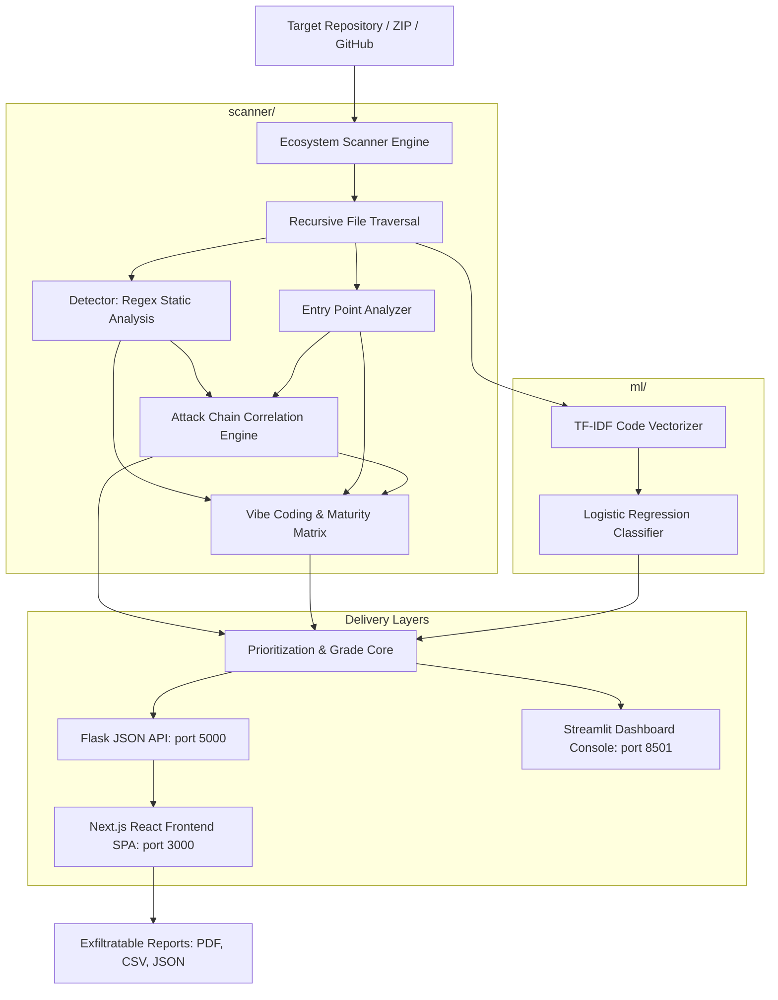

# CodeSentinel ML: AI-Assisted Repository Security Intelligence Platform

**Ecosystem Project Presentation & Internship Demonstration Material**  
*Strategic Cybersecurity SOC Analytics & Threat Intelligence*

---

## 1. Executive Project Summary

**CodeSentinel ML** is a state-of-the-art, production-style Minimum Viable Product (MVP) cybersecurity platform designed to traverse, scan, classify, and mitigate repository-level software vulnerabilities. Built using a **hybrid intelligence approach**, it blends deterministic static analysis (regex signatures) with local supervised machine learning (TF-IDF + Logistic Regression) to deliver explainable security telemetry, prioritize flaws, map exploit paths, and assess architectural security maturity.

Developed to operate **100% locally**—maintaining total code confidentiality with no external LLM dependencies, no database requirements, and no cloud-computing footprint—CodeSentinel ML provides security operations center (SOC) analysts and developers with a futuristic, highly interactive "Kevlar, Chrome & Flare" visual dashboard built on Streamlit and React/Next.js.

---

## 2. Internship & Educational Context

*   **Host Environment**: Cyber Defense & Security Engineering Internship.
*   **Role**: Cybersecurity & ML Engineering Intern.
*   **Project Directive**: Design and build an automated repository-level scanner that bridges the gap between raw compiler logs and modern executive threat intelligence, introducing a customizable coding discipline assessment index.
*   **Engineering Goals achieved**:
    1.  Designed a recursive file traversal engine supporting Multi-language projects (Python, JS, PHP, Java) with built-in depth limits and size protection thresholds.
    2.  Developed a local machine learning classification pipeline with scikit-learn that evaluates syntactic code structures.
    3.  Handcrafted a customized mathematical scoring metric: the **Vibe Coding Risk Index**.
    4.  Engineered an end-to-end telemetry system mirroring backend scores between a Python Streamlit console and a modern Next.js/React framework SPA.

---

## 3. The Problem Statement & Industry Gaps

Modern developer workflows rely heavily on rapid prototyping and "vibe coding" (authoring complex logic quickly under the guidance of generative tools). This fast-paced behavior introduces unique security anti-patterns:
*   **Unvetted Sinks**: Dynamic evaluation (like `eval()`, `exec()`, or raw shell commands) directly receiving attacker-controlled HTTP params.
*   **credential Exposure**: Hardcoding secret tokens and credentials for quick API testing.
*   **Silent Error Silencing**: Wrapping critical blocks in bare `except:` statements, blinding security auditing logs.
*   **Broken Cryptography**: Reverting to weak MD5/SHA-1 hashing or insecure seed randomisation for secure cryptographic operations.

### The Industry Gap:
Existing Static Application Security Testing (SAST) tools are either **too verbose** (generating thousands of unprioritized false positives) or **require expensive, cloud-dependent neural networks** that compromise private proprietary source code. CodeSentinel ML bridges this gap by being **100% private, local, and explainable**.

---

## 4. Platform Architectural Design

CodeSentinel ML is structured as a modular, beginner-friendly, and highly maintainable cybersecurity ecosystem.

### Modular Components:
1.  **Central Registry (`scanner/patterns.py`)**: Consolidates regex signatures for high/medium/low severity vulnerabilities, web inputs (Flask, Express, PHP), and vibe coding syntax.
2.  **Static Detector (`scanner/detector.py`)**: Computes structural code metadata, analyzes comments-to-code ratios, and executes regex scanning.
3.  **Entry Point Analyzer (`scanner/entry_detector.py`)**: Maps HTTP query parameters, form fields, and route handlers.
4.  **Attack Chain Engine (`scanner/attack_chain.py`)**: Analyzes lines surrounding entry points to identify dynamic input-to-sink vulnerability paths.
5.  **ML Pipeline (`ml/model.py`)**: Manages the local training, preprocessing, vectorization, and prediction logic.
6.  **Defensive Prioritization (`scanner/prioritizer.py`)**: Calculates unified risk scores by boosting findings that exhibit attack chain or ML-predicted high-risk attributes.
7.  **Intelligence Synthesis (`scanner/intelligence.py`)**: Evaluates the letter grade (A/B/C/D/F), formulates narrative statements, and constructs terminal SOC event logs.

---

## 5. Uniqueness & Innovation Highlights

*   **Vibe Coding Risk Index**: A tailored mathematical risk index reflecting general code hygiene. It punishes code shortcuts like wildcard CORS, bare exceptions, and disabled SSL verifications.
*   **Defensive Code Architecture Patch Panel**: A dual-state UI panel in both Streamlit and Next.js that contrasts the vulnerable code statement directly with a secure, production-ready code state.
*   **Local Explainable ML**: Instead of black-box predictions, the model decomposes files to identify the exact syntactic trigger tokens causing a High/Medium risk classification.
*   **Deterministic Integrity**: No reliance on flaky, non-deterministic LLM prompts. 100% consistent results for identical source inputs.

---

## 6. Future Enhancements & Scalability

1.  **Abstract Syntax Tree (AST) Parsing**: Transition from regex line-matching to standard AST graph parsing to trace multi-file semantic variables.
2.  **Pre-Commit Hook Integration**: Provide a CLI binary that prevents insecure commits directly at the Git hook level.
3.  **Local Deep-Learning (ONNX)**: Support local, lightweight transformer models (e.g. CodeBERT) packaged via ONNX runtime for sub-second, highly complex semantic classifications.
4.  **Automated Patching**: Let the scanner suggest and write the secure code state back into the repository with single-click approvals.
